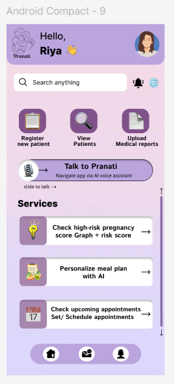
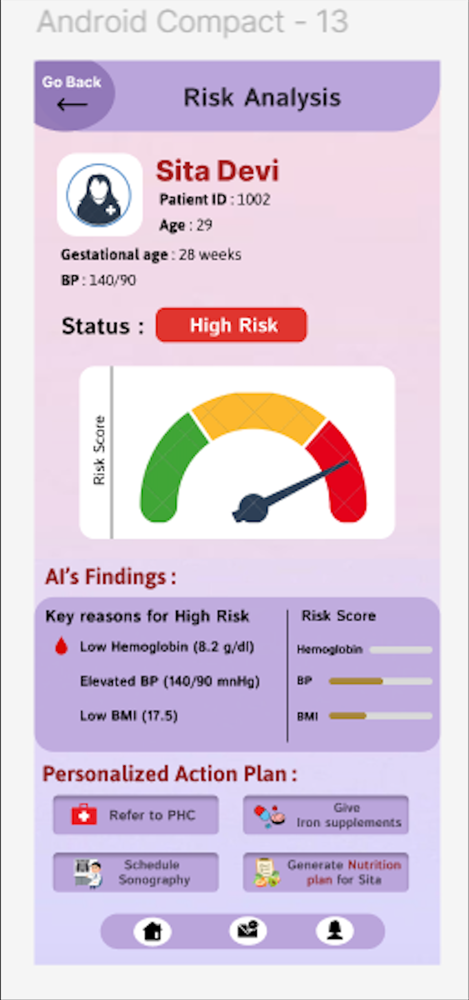
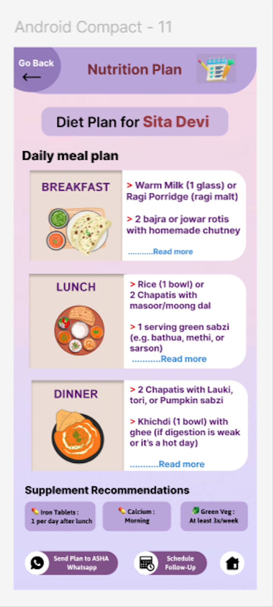

# Pranati-maternal-health
AI-powered maternal health assistant for ASHA workers — predicts high-risk pregnancies, generates personalized nutrition plans, and works offline with regional language support.

# 🌸 Pranati — AI-Powered Maternal Health Assistant for ASHA Workers

Pranati is a mobile-first web app our team (Nari Zone) has designed to support ASHA workers in rural India by identifying high-risk pregnancies, generating personalized nutrition plans, and simplifying patient management — even in low-connectivity environments.

---

## 📸 Demo Preview

---

## 🧠 Key Features
✅ Offline-first experience using Service Workers & IndexedDB
🎯 AI-powered high-risk pregnancy detection (XGBoost + TensorFlow Lite)
🧾 OCR-based test report scanning and auto-fill (Tesseract.js)
🍲 Personalized nutrition plans based on local diets and risk profile
📋 Simple patient record management—easy to update and access anytime
🗣️ Voice input (Whisper) and text-to-speech guidance for hands-free use
🌐 Regional language support with translation (M2M-100) and TTS
🔒 Secure, consent-based local data storage
📲 Touch-friendly, intuitive UI designed for low digital literacy

---

## 🧰 Tech Stack

- Frontend: React + Tailwind CSS
- AI/ML: TensorFlow Lite, XGBoost, Mistral, Whisper, M2M-100
- OCR: Tesseract.js
- Offline Storage: IndexedDB + Service Workers
- Deployment: GitHub Pages (Planned)

---

## 📁 Folder Structure
pranati/
├── public/
│   └── index.html
├── src/
│   ├── assets/
│   │   └── logos, icons, etc.
│   ├── components/
│   │   └── Navbar.jsx, Form.jsx, etc.
│   ├── pages/
│   │   └── Home.jsx, RiskAssessment.jsx, NutritionPlan.jsx
│   ├── services/
│   │   └── aiUtils.js, ocrUtils.js
│   ├── ml-models/             # TFLite / XGBoost
│   ├── i18n/                  # Translations and language support
│   ├── App.jsx
│   └── index.js
├── screenshots/
│   └── home.png, risk-assessment.png, nutrition.png
├── README.md
├── package.json
└── .gitignore

